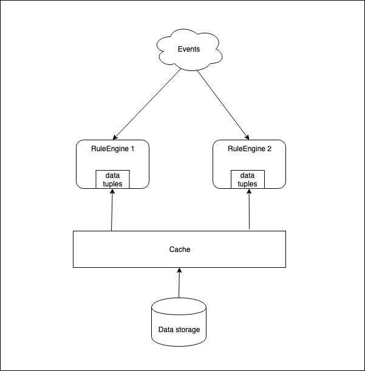

## Caching

Tuples can be categorized into two different types depending on their nature of durability. The event tuples, due to their transient nature, are to be consumed as it is processed by the rule engine. The data tuples, due to their persistent nature, are expected to be available within the rule network for evaluations and actions across the event tuples entered in the fule network. 

The data tuples also are expected to be stored in a persistent storage - i.e. database,distributed cache, files on disk, etc. 

For example, a data tuple would be a user's credit score while event tuple is a credit card application. A rule can be writtten to approve a credit card by joining user's credit tuple and credit card application.

### readonly tuple cache

A readonly tuple cache is supported with the following characteristics:
- readonly tuples are available in the cache and to be loaded before a rule session receives an event tuple.
- persistMode attribute value of "ReadOnlyCache" in the tuple descriptor indicates that the tuple is to be loaded from the cache into the rule network.
- TTL of the readonly cache is -1.
- A distributed cache would enable scale rule engine instances as needed from a single tuple data source as shown below.

  

