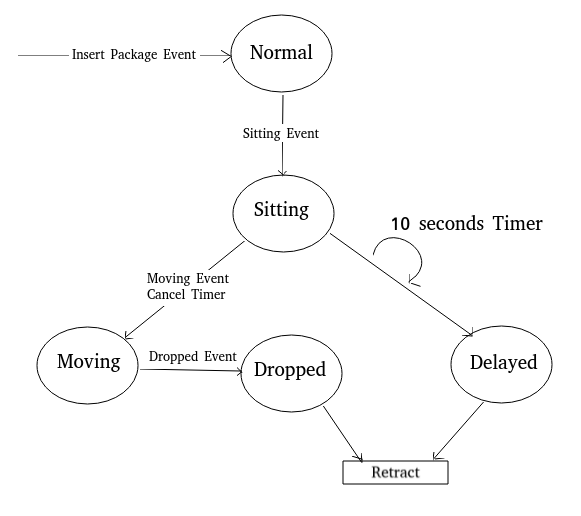

This example demonstrates the capability of rules to track and trace for a flogo app. In this example three tuples used, tuples description is shown below.

```json
{
    "name": "package",
    "properties": [
        {
            "name": "id",
            "type": "string",
            "pk-index": 0
        },
        {
            "name": "state",
            "type": "string"
        }
    ]  
},
{
    "name": "moveevent",
    "ttl": 0,
    "properties": [
        {
            "name": "id",
            "type": "string",
            "pk-index": 0
        },
        {
            "name": "packageid",
            "type": "string"
        },
        {
            "name": "targetstate",
            "type": "string"
        }
    ]
},
{
    "name": "movetimeoutevent",
    "ttl": 0,
    "properties": [
        {
            "name": "id",
            "type": "string",
            "pk-index": 0
        },
        {
            "name": "packageid",
            "type": "string"
        },
        {
            "name": "timeoutinmillis",
            "type": "integer"
        }
    ]  
}
```

`package` tuple is always stored in network, while the other tuples `moveevent` and `movetimeoutevent` are removed immediate after its usage as `ttl` given `0`. During startup `PACKAGE1` is asserted into network.

Consider system having incoming packages. In order to move packages from source to destination we have steps like sitting,moving,dropped and delayed. When the first event sitting comes, package is scheduled to 10s timeout. Within 10s if we receive  moving event then scheduled timeout event will get canceled. Otherwise package is marked as delayed and retracted from network.

### Package State Info

<p align="center">
  
</p>

In detail above image represents state change for a given package. Consider insert package event this will insert a package into cluster with state as `normal`. This package now accepts only `sitting` event, If `sitting` event is triggered a 10 seconds timer is created to trigger `delayed` event, within 10s only `moving` event can cancel the timer and state is changed to `moving` otherwise `delayed` event gets triggered. If `dropped` event occurs then package state is changed to `dropped`. Any package with state as `dropped` or `delayed` package is retracted from network. You have to re-insert the package again to use.

### Actions used here

`aJoinMoveEventAndPackage` : If targetstate value sitting then package is scheduled to movetimeoutevent by 10 seconds.<br>
`aPrintMoveEvent`: Prints received moveevents and store packages into network based on targetstate.<br>
`aMoveTimeoutEvent`: Prints received movetimeoutevent.<br>
`aJoinMoveTimeoutEventAndPackage`: Package is modified to moveevent target state.<br>
`aPackageInSitting`: Prints package as sitting.<br>
`aPackageInMoving`: Prints package as moving.<br>
`aPackageInDropped`: Prints package as dropped and retracts package tuple from network.<br>
`aPackageInDelayed`: Prints package as delayed and retracts package tuple from network.

## Usage
Get the repo and in this example `main.go`, `functions.go` both are available we can directly build and run the app or create flogo rule app and run it.

### Direct build and run
```sh
cd $GOPATH/src/github.com/project-flogo/rules/examples/flogo/trackntrace
go build
./trackntrace
```

### Create app using flogo cli
```sh
cd $GOPATH/src/github.com/project-flogo/rules/examples/flogo/trackntrace
flogo create -f flogo.json trackNTraceApp
cp functions.go trackNTraceApp/src
cd trackNTraceApp
flogo build
./bin/trackNTraceApp
```

## Moveevent test
Run below command to check moveevent action on PACKAGE1.
```sh
curl http://localhost:7777/moveevent?packageid=PACKAGE1\&targetstate=sitting
```

Above commands results in executing action `aJoinMoveTimeoutEventAndPackage` from `aJoinMoveEventAndPackage`. Action `aJoinMoveTimeoutEventAndPackage` results in changing state of PACKAGE1 to sitting this will trigger another action `aPackageInSitting`. So chain of actions getting executed.<br><br>
Expected output:
```
Received a 'moveevent' [01DDMW3RMDPKS5JR8JWAMY2VT2] target state [sitting]
Joining a 'moveevent' with packageid [PACKAGE1] to package [PACKAGE1], target state [sitting]
Starting a 10s timer.. [PACKAGE1]
PACKAGE [PACKAGE1] is Sitting
Received a 'movetimeoutevent' id [01DDMW3RMD03JAJGQ35VZB1QP8], packageid [PACKAGE1], timeoutinmillis [10000]
Joining a 'movetimeoutevent' [PACKAGE1] to package [PACKAGE1], timeout [10000]
PACKAGE [PACKAGE1] is Delayed
```
Above we can see `PACKAGE1` is went into delayed as moving event is not done in scheduled 10s interval. Restart the rules app and run below command.

```sh
curl http://localhost:7777/moveevent?packageid=PACKAGE1\&targetstate=sitting
curl http://localhost:7777/moveevent?packageid=PACKAGE1\&targetstate=moving
```
Expected output:
```
Received a 'moveevent' [01DDMW5J161J3W9P9SN1GDH3DN] target state [sitting]
Joining a 'moveevent' with packageid [PACKAGE1] to package [PACKAGE1], target state [sitting]
Starting a 10s timer.. [PACKAGE1]
PACKAGE [PACKAGE1] is Sitting
Received a 'moveevent' [01DDMW5JXFMY4W0MC6NYRQDZ9H] target state [moving]
Joining a 'moveevent' with packageid [PACKAGE1] to package [PACKAGE1], target state [moving]
Cancelling timer attached to key [PACKAGE1]
PACKAGE [PACKAGE1] is Moving
```
## Package Insert
Execute below command to store `PACKAGE2`
```sh
curl http://localhost:7777/moveevent?packageid=PACKAGE2\&targetstate=normal
```
Expected output:
```
Received a 'moveevent' [01DDMW6EK0Z9D4KJ0ZGXP6K0WM] target state [normal]
Tuple inserted successfully:  PACKAGE2
Received package [PACKAGE2]
```